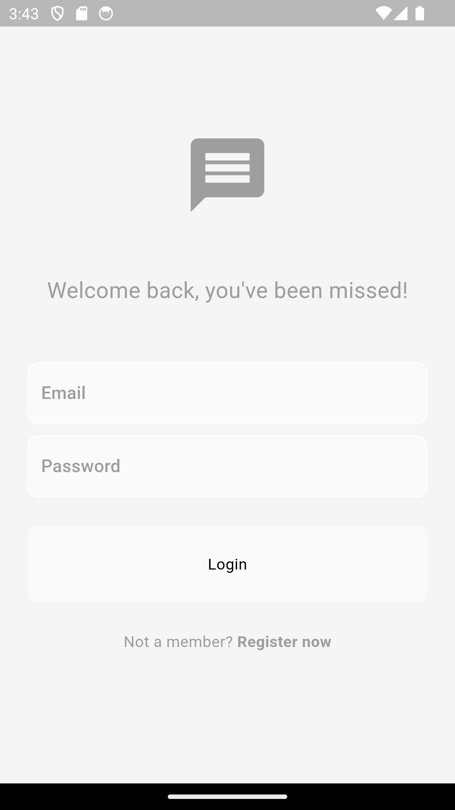
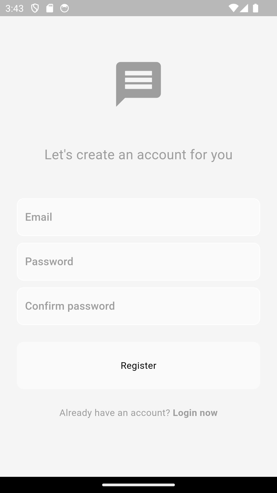
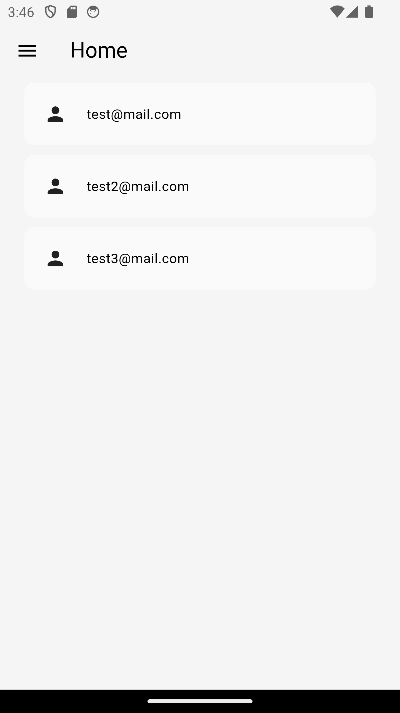
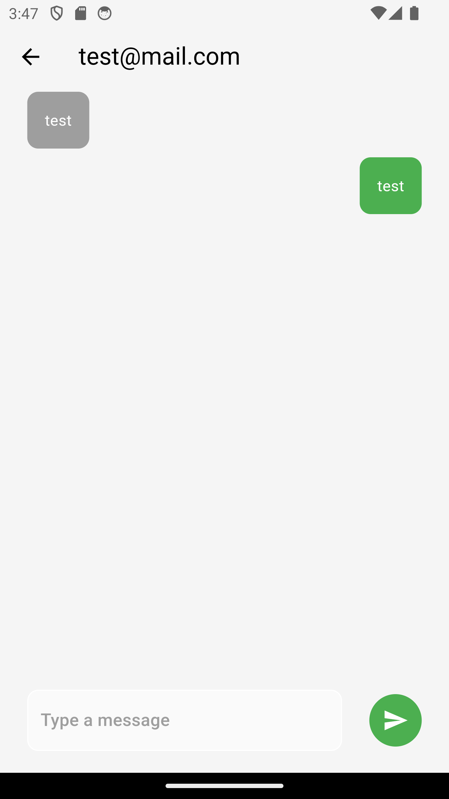
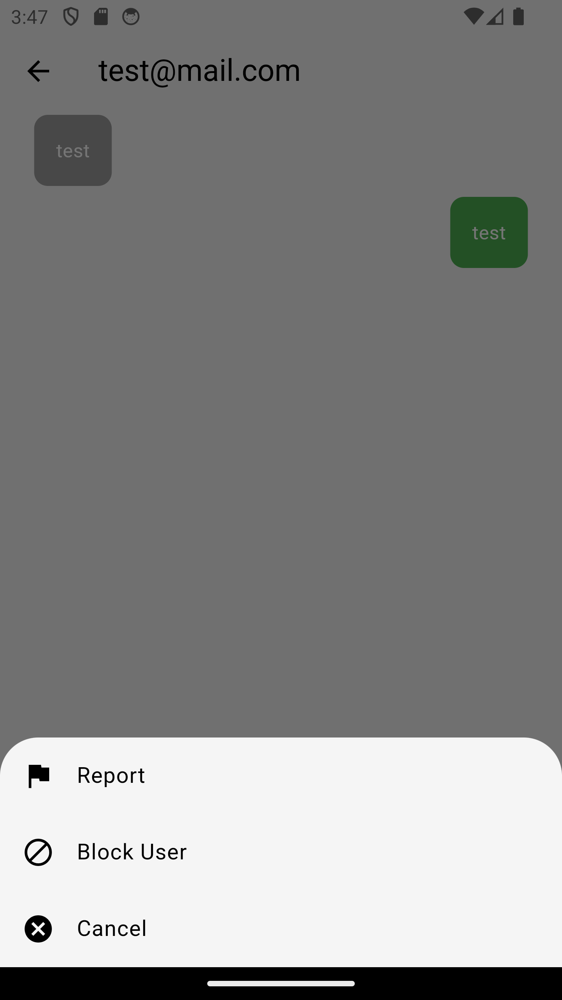
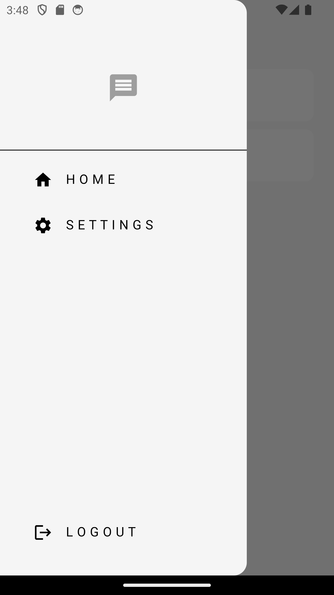
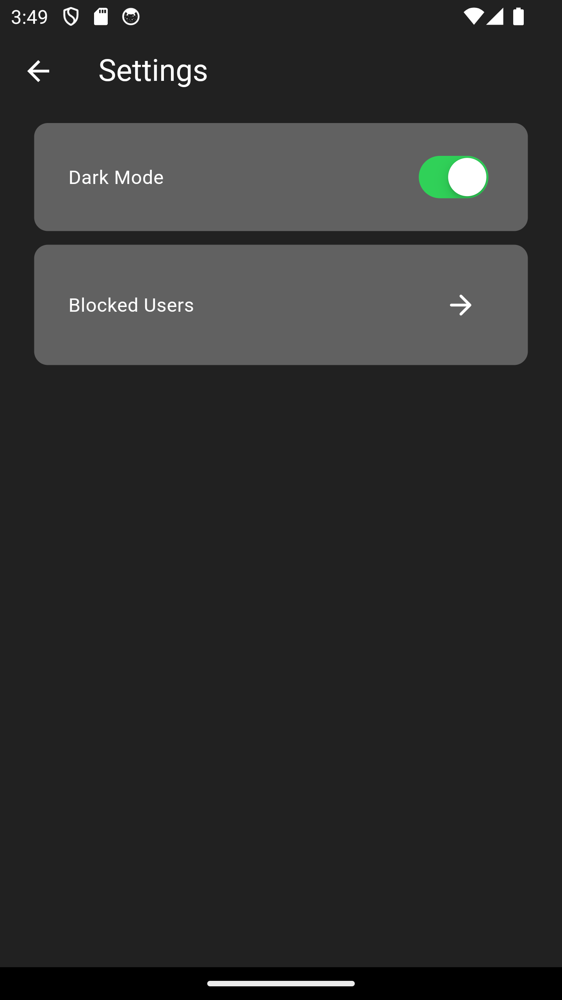

# Chat App

Chat App is a sleek and intuitive chat application built with Flutter. It’s designed to help you stay connected with friends, family, and colleagues with ease. Whether you’re keeping in touch with loved ones or managing your professional network, Chat Connect offers a smooth and engaging messaging experience.

## Features

- **User-Friendly Interface**: Navigate effortlessly with a clean design. The home page, interactive user list, and chat access are all optimized for ease of use.

- **Real-Time Updates**: Stay in the loop with live updates from our chat service, ensuring you receive the latest messages and user activity instantly.

- **Personalized Chat Experience**: Find and connect with users from your network easily. The app filters out blocked users, so you only see the people you want to interact with.

- **Secure and Private**: Enjoy secure authentication and privacy features that keep your conversations safe and confidential.

- **Effortless Navigation**: With a straightforward app bar, convenient drawer menu, and user-friendly chat interface, managing your chats and contacts is simple and efficient.

## Screenshots

### Login Screen

### Register Screen

### Home

### Messages

### Block User

### Drawer

### Dark Mode

